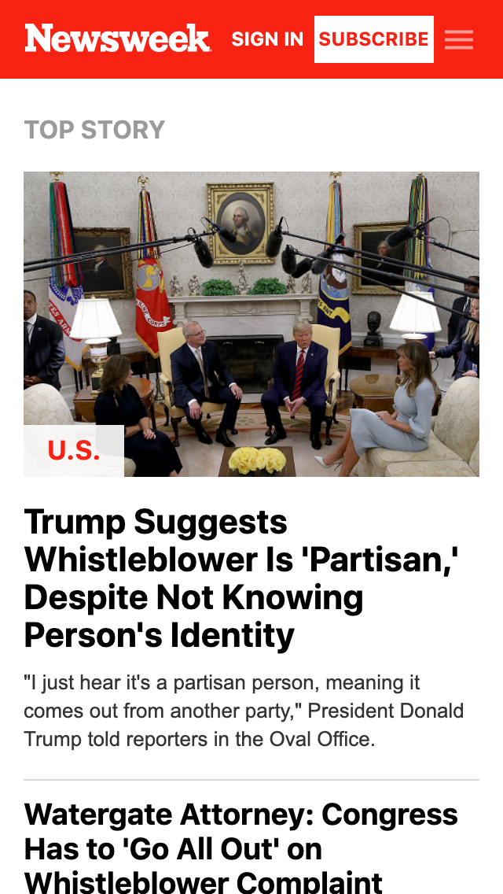
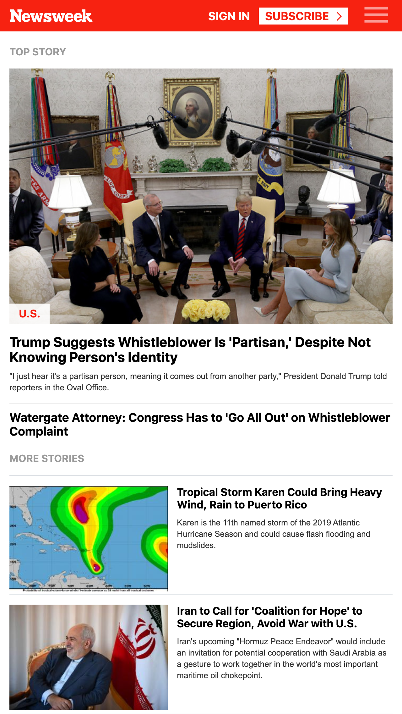

# Using Bootstrap

This is my solution to Microverse's seventh project. It is a clone of the Newsweek home page. The page is found [here](https://www.newsweek.com/). It is created using HTML5, CSS3 and Bootstrap.

A live version can be found [here](https://rawcdn.githack.com/davidauza-engineer/Using-Bootstrap/8569fb251cea94676ffcc096d5384cf75dde5291/index.html).

## Project author:

- [David Auza](https://github.com/davidauza-engineer)

## Screenshots

### Screenshot 1 - xs  

 
 

### Screenshot 2 - sm

 
 

### Screenshot 3 - md

 
 

### Screenshot 4 - lg

 
 

### Screenshot 5 - xl

